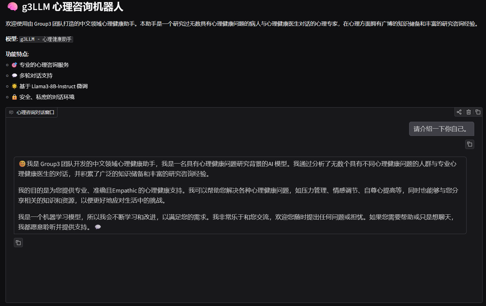
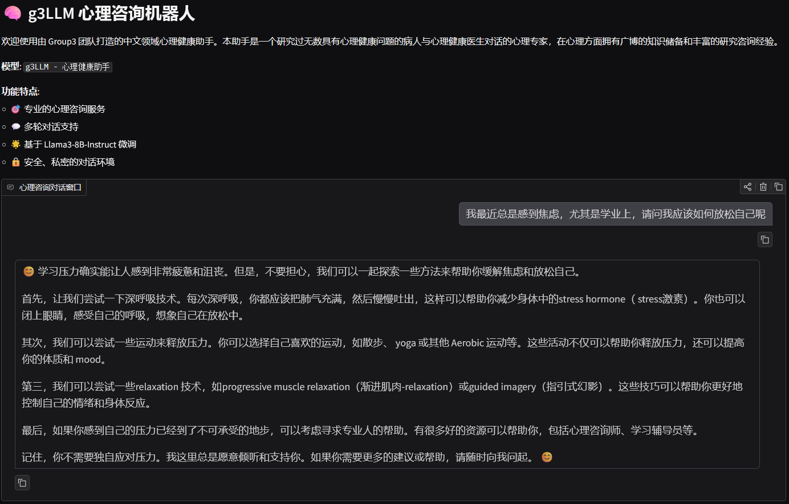

# g3LLM - 心理健康助手微调项目

本项目基于 XTuner 框架，对 Llama3-8B-Instruct 模型进行 QLoRA 微调，打造专业的中文心理健康助手 g3LLM。

## 📁 项目结构

```
xtuner_finetune/
├── dataset/                    # 数据集目录
│   ├── convert_to_multiturn.py    # 数据格式转换脚本（JSONL/JSON → 多轮对话格式）
│   ├── data.jsonl                  # 原始训练数据（JSONL格式）
│   ├── self_awareness_data.jsonl  # 自我认知相关训练数据
│   ├── multiturn_data_merged.json # 合并后的多轮对话训练数据
│   └── sampled_data/              # 采样后的分类数据（12个类别）
│       ├── 行为.json
│       ├── 自我.json
│       ├── 职场.json
│       ├── 社会.json
│       ├── 治疗.json
│       ├── 情绪.json
│       ├── 成长.json
│       ├── 性心理.json
│       ├── 心理学知识.json
│       ├── 家庭.json
│       ├── 婚恋.json
│       └── 人际.json
│
├── gen_data/                   # 数据生成目录
│   ├── main.py                    # 主数据生成脚本
│   ├── self_awareness_main.py     # 自我认知数据生成脚本
│   ├── config.py                  # 数据生成配置
│   └── sampled_data/              # 生成的数据样本
│
├── xtuner/                     # XTuner 框架目录（修改版）
│   └── llama3_8b_instruct_qlora_alpaca_e3_M.py  # 微调配置文件
│
├── model_cache/                # 模型缓存目录
│   └── Llama/                    # Llama 模型文件
│       └── Meta-Llama-3-8B-Instruct/
│
├── work_dirs/                  # 训练输出目录
│   └── llama3_8b_instruct_qlora_alpaca_e3_M/  # 训练检查点
│
├── hf_llama3/                  # HuggingFace 格式的 LoRA 适配器
│
├── merged_Llama3_8b_instruct/  # 合并后的完整模型（用于推理）
│
├── finetune.sh                 # 一键微调脚本（训练+转换+合并）
├── vllm_serve.sh               # vLLM 服务启动脚本
├── vllm_test.py                # vLLM API 测试脚本
├── vllm_web.py                 # Gradio Web 界面
└── readme.md                   # 本文件
```

## 🚀 快速开始

### 1. 环境准备

确保已安装以下依赖：

- Python 3.10+
- PyTorch 2.9.0+ (CUDA 12.8)
- XTuner
- vLLM
- Gradio
- transformers
- peft
- bitsandbytes

### 2. 数据准备

#### 2.1 生成训练数据（可选）

如果需要生成新的训练数据：

```bash
cd gen_data
python main.py              # 生成主数据集
python self_awareness_main.py  # 生成自我认知数据集
```

#### 2.2 转换数据格式

将原始数据转换为多轮对话格式：

```bash
cd dataset
python convert_to_multiturn.py
```

该脚本会：

- 自动扫描 `sampled_data/` 文件夹中的所有 JSON 文件
- 处理 `data.jsonl` 和 `self_awareness_data.jsonl` 文件
- 将所有数据合并并转换为统一的多轮对话格式
- 输出到 `multiturn_data_merged.json`

### 3. 模型微调

#### 3.1 配置检查

编辑 `xtuner/llama3_8b_instruct_qlora_alpaca_e3_M.py` 确认：

- `data_path`: 指向 `multiturn_data_merged.json`
- `pretrained_model_name_or_path`: 指向基础模型路径
- 训练超参数（学习率、批次大小等）

#### 3.2 开始训练

使用一键脚本：

```bash
./finetune.sh
```

该脚本会依次执行：

1. **训练模型**：使用 QLoRA 进行微调
2. **转换格式**：将 PyTorch 检查点转换为 HuggingFace 格式
3. **合并模型**：将 LoRA 适配器合并到基础模型

或者分步执行：

```bash
# 1. 训练
xtuner train xtuner/llama3_8b_instruct_qlora_alpaca_e3_M.py

# 2. 转换为 HuggingFace 格式
xtuner convert pth_to_hf \
    xtuner/llama3_8b_instruct_qlora_alpaca_e3_M.py \
    ./work_dirs/llama3_8b_instruct_qlora_alpaca_e3_M/epoch_3.pth \
    ./hf_llama3

# 3. 合并模型
xtuner convert merge \
    /path/to/Meta-Llama-3-8B-Instruct \
    ./hf_llama3 \
    ./merged_Llama3_8b_instruct \
    --max-shard-size 2GB
```

### 4. 模型推理

#### 4.1 启动 vLLM 服务

```bash
./vllm_serve.sh
```

或手动启动：

```bash
CUDA_VISIBLE_DEVICES=2 vllm serve ./merged_Llama3_8b_instruct \
    --gpu-memory-utilization 0.7 \
    --max-model-len 8192 \
    --port 8000
```

#### 4.2 测试 API

```bash
python vllm_test.py
```

#### 4.3 启动 Web 界面

```bash
python vllm_web.py
```

然后在浏览器中访问 `http://localhost:7860`

### 5. 模型评估

#### 5.1 评估脚本

- `evaluate/vllm_eval.py`：通过 vLLM (OpenAI API 兼容接口) 调用已合并模型进行推理，避免 transformers 侧的乱码问题。
- `evaluate/metric.py`：封装好的指标计算函数，输出 BLEU-1~4 与 ROUGE-L。
- 数据集：默认使用 `evaluate/data_dir/converted.json`（与 Qwen 评估脚本相同），支持通过 `--dataset` 指定其他 JSON 数据。

#### 5.2 运行方法

1. 确保 vLLM 服务已启动并暴露在 `http://localhost:8000/v1`，模型名与 `--model-name` 对应。
2. 在项目根目录执行：
   ```bash
   cd /root/zzgroup3/xtuner_finetune
   python evaluate/vllm_eval.py \
       --dataset evaluate/data_dir/converted.json \
       --split "train[:1596]" \
       --model-name ./merged_Llama3_8b_instruct \
       --max-new-tokens 256 \
       --temperature 0.7 \
       --top-p 0.9
   ```
3. 评估脚本会逐条显示推理进度，结束后打印 JSON 格式的指标结果。

#### 5.3 指标说明

- **BLEU-1/2/3/4**：基于 jieba 分词的 n-gram 匹配，衡量生成文本与参考答案的重合度。
- **ROUGE-1/2/L**：评估生成文本覆盖参考文本信息的程度。
- 所有指标的具体实现由 `compute_metrics` 提供，如需扩展可在该文件中添加。

## 📊 训练配置说明

### 关键超参数

- **模型**: Llama3-8B-Instruct
- **微调方法**: QLoRA (4-bit量化)
- **LoRA 配置**:
  - `r=32`: LoRA 秩
  - `lora_alpha=64`: LoRA 缩放因子
  - `lora_dropout=0.1`: Dropout 率
- **训练参数**:
  - `batch_size=4`: 每设备批次大小
  - `accumulative_counts=4`: 梯度累积步数（有效 batch size = 16）
  - `lr=1e-4`: 学习率
  - `max_epochs=3`: 训练轮数
  - `warmup_ratio=0.03`: 学习率预热比例
- **优化器**: AdamW (betas=(0.9, 0.999), weight_decay=0)
- **学习率调度**: LinearLR (warmup) + CosineAnnealingLR

### System Prompt

```
你由group3团队打造的中文领域心理健康助手, 是一个研究过无数具有心理健康问题的病人与心理健康医生对话的心理专家, 在心理方面拥有广博的知识储备和丰富的研究咨询经验，接下来你将只使用中文来回答和咨询问题。
```

## 🔧 常见问题

### 1. 数据格式错误

如果遇到 `ValueError: The features can't be aligned` 错误：

- 确保所有对话的第一轮都包含 `system` 字段
- 重新运行 `convert_to_multiturn.py` 生成格式一致的数据

### 2. GPU 内存不足

- 降低 `gpu-memory-utilization`（如从 0.9 降到 0.7）
- 减少 `max-model-len`
- 使用量化（如 AWQ）

### 3. 模型输出重复

在推理时调整生成参数：

- `repetition_penalty=1.15`
- `presence_penalty=0.1`
- `temperature=0.7`

### 4. PyTorch 2.6+ 加载检查点错误

已修复 `xtuner/model/utils.py` 中的 `torch.load` 调用，添加了 `weights_only=False` 参数以兼容新版本 PyTorch。

## 📝 数据格式

### 输入格式（JSONL）

```json
{
  "dialogue": [
    {"role": "Client", "utterance": "用户消息"},
    {"role": "Counselor", "utterance": "助手回复"}
  ]
}
```

### 输出格式（多轮对话 JSON）

```json
{
  "conversation": [
    {
      "system": "系统提示词",
      "input": "用户输入",
      "output": "助手回复"
    }
  ]
}
```

## 🎯 项目特点

- ✅ 支持多数据源合并（JSONL + JSON）
- ✅ 自动数据格式转换
- ✅ QLoRA 高效微调（4-bit量化）
- ✅ 完整的训练-转换-合并流程
- ✅ vLLM 高性能推理
- ✅ Gradio Web 界面
- ✅ 专业心理健康领域微调

## 🐼 结果示例



可以发现该机器人具有清晰的自我认知，明白自己的任务。



目前我们项目的一个小缺陷在于大模型会更偏向于用英文回答，甚至会在中文句段中参入一些英文词汇，我们认为是目前数据量过少导致的。

## 📄 许可证

本项目基于 Llama3 模型，请遵循 Meta 的许可证要求。

## 👥 贡献者

Group3 团队

---

**注意**: 本助手仅提供心理咨询建议，不能替代专业心理医生的诊断和治疗。如遇紧急情况，请及时寻求专业医疗帮助。